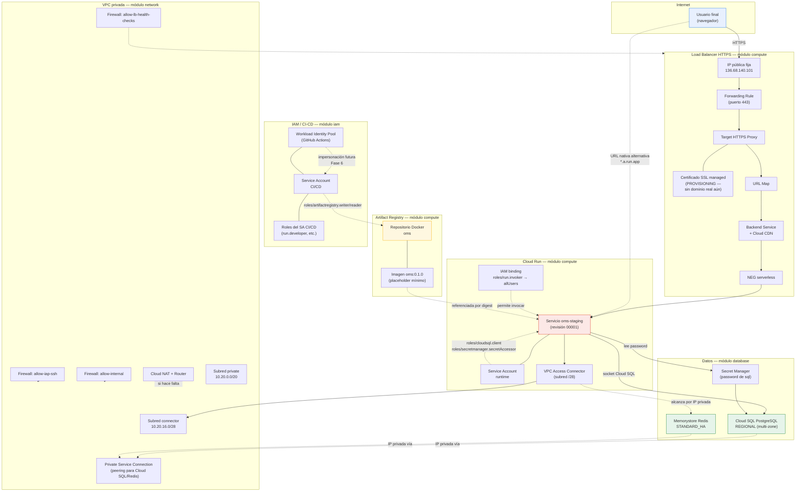

# DIAGRAMAS.md — AcmeOMS / oms-platform

> **Documento vivo.** Se actualiza en cada fase del proyecto. La versión actual cubre únicamente lo que está **construido, aplicado y verificado en GCP real** (Fases 1, 2 y 3 — 38 recursos en el proyecto `acmeoms-staging-fatm`). Cuando avancen las Fases 4 (Ansible), 6 (CI/CD) y 7 (bonus), este documento se amplía con los diagramas correspondientes — no se documenta aquí nada que todavía no exista de verdad.
>
> Para el detalle de cómo y por qué se construyó cada pieza (incluyendo los hallazgos y correcciones reales del camino), ver [`BITACORA-COMANDOS.md`](BITACORA-COMANDOS.md). Para el estado y las decisiones del proyecto, ver [`../PROGRESO.md`](../PROGRESO.md).

---

## 1 · Diagrama de relación entre artefactos

Vista completa de los 38 recursos aplicados, agrupados por módulo de Terraform, con las flechas mostrando quién depende de quién o quién se comunica con quién.

**Cómo leer las flechas:** líneas sólidas (`-->`) son el camino real del tráfico de una petición HTTP. Líneas punteadas (`-.->`) son relaciones de configuración/permisos (IAM, referencias) que no son tráfico en sí.

---

## 2 · Tabla resumen — qué es cada artefacto y para qué sirve

### Módulo `network` (10 recursos)

| Artefacto | Para qué sirve |
|---|---|
| VPC (`oms-staging-vpc`) | Red privada propia del proyecto; el "terreno" donde vive todo lo demás, aislado de otras redes |
| Subred `private` (`10.20.0.0/20`) | Rango de IPs privadas para recursos generales (hoy sin uso directo de VMs, preparada para el futuro) |
| Subred `connector` (`10.20.16.0/28`) | Rango de IPs dedicado y de tamaño exacto que exige GCP para el VPC Access Connector |
| Private Service Connection | El "puente" que permite que Cloud SQL y Redis (servicios gestionados de Google, fuera de tu VPC) tengan una IP privada dentro de tu red |
| Cloud Router + Cloud NAT | Permite que recursos sin IP pública puedan iniciar conexiones salientes a internet, sin exponer nada a conexiones entrantes |
| Firewall `allow-internal` | Permite que los recursos de la propia VPC se hablen entre sí (por defecto, todo está bloqueado incluso internamente) |
| Firewall `allow-iap-ssh` | Permite SSH seguro sin IP pública, vía Identity-Aware Proxy — preparado para el bastion del bonus (aún no usado) |
| Firewall `allow-lb-health-checks` | Permite que el Load Balancer verifique que Cloud Run está vivo, desde los rangos oficiales de Google |

### Módulo `database` (7 recursos)

| Artefacto | Para qué sirve |
|---|---|
| Cloud SQL (`oms-staging-postgres`) | Base de datos relacional PostgreSQL, en modo `REGIONAL` (alta disponibilidad multi-zona) |
| Base de datos `oms` | La base de datos lógica dentro de la instancia, donde vivirían las tablas de la aplicación real |
| Usuario `oms_app` | Credencial de aplicación para conectarse a la base de datos (no la del administrador) |
| `random_password` | Generador de la contraseña aleatoria del usuario de la base de datos — nunca escrita a mano en el código |
| Secret (`oms-staging-db-password`) + su versión | Almacén seguro de esa contraseña, para que la aplicación la lea en tiempo de ejecución sin que quede en texto plano en ningún archivo |
| Memorystore Redis | Caché en memoria, pensada para acelerar lecturas frecuentes (ej. catálogo de productos) |

### Módulo `compute` (10 recursos)

| Artefacto | Para qué sirve |
|---|---|
| Service Account `runtime` | La "identidad" con la que corre el contenedor de la aplicación (permisos mínimos: leer secretos, conectar a la base de datos) |
| Artifact Registry (`oms`) | El almacén privado donde vive la imagen Docker de la aplicación |
| VPC Access Connector | El puente que permite a Cloud Run (que vive fuera de tu VPC) alcanzar Redis por IP privada |
| Servicio Cloud Run (`oms-staging`) | Donde realmente corre el contenedor de la aplicación — escala automáticamente según la carga |
| Permiso de invocación pública | Autoriza que cualquiera pueda llamar al servicio (sin esto, Cloud Run rechaza toda petición) |
| NEG serverless | El "puntero" que conecta el mundo de Load Balancers con un servicio sin servidor como Cloud Run |
| Backend Service + Cloud CDN | Agrupa el NEG y define la política de caché de contenido estático |
| URL Map | Decide, según la URL pedida, a qué backend enviar la petición |
| Certificado SSL managed | El certificado HTTPS del dominio (hoy en `PROVISIONING`, pendiente de un dominio real) |
| Target HTTPS Proxy + Forwarding Rule + IP pública | Las piezas finales que conectan la IP pública fija con el tráfico HTTPS entrante |

### Módulo `iam` (11 recursos)

| Artefacto | Para qué sirve |
|---|---|
| Workload Identity Pool + Provider | El mecanismo que permitirá a GitHub Actions autenticarse ante GCP sin ninguna clave guardada (Fase 6) |
| Service Account `cicd` | La identidad que usará el pipeline de despliegue automático |
| Binding de impersonación | Autoriza que solo el repositorio de GitHub correcto pueda "convertirse" en ese Service Account |
| Roles del SA `cicd` (×4) | Permisos mínimos del pipeline: desplegar en Cloud Run, usar el SA de runtime, publicar/leer imágenes |
| Roles del SA `runtime` (×2) | Permisos mínimos del contenedor en ejecución: conectar a Cloud SQL, leer el secreto de la contraseña |

---

## 3 · Glosario de términos

| Término | Qué significa |
|---|---|
| **VPC** (Virtual Private Cloud) | Tu red privada propia dentro de GCP — el equivalente en la nube a la red local de una oficina, aislada de otras redes |
| **Subred** | Un rango específico de direcciones IP dentro de la VPC, asociado a una región, donde se alojan recursos |
| **CIDR** | Notación para expresar un rango de IPs (ej. `10.20.0.0/16`) — el número tras la barra indica cuántos bits están "fijos" |
| **IAM** (Identity and Access Management) | El sistema de GCP que controla quién (persona o programa) puede hacer qué, sobre qué recursos |
| **Service Account (SA)** | Una "identidad" para que un programa (no una persona) se autentique y tenga permisos — el equivalente a un usuario, pero para máquinas |
| **Rol IAM** | Un conjunto de permisos agrupados con un nombre (ej. `roles/run.developer` = "puede desplegar en Cloud Run") |
| **WIF** (Workload Identity Federation) | Mecanismo que permite a un sistema externo (como GitHub Actions) autenticarse ante GCP sin usar una clave descargada, mediante tokens temporales |
| **OIDC** (OpenID Connect) | El protocolo estándar sobre el que funciona WIF — un token firmado que certifica "quién eres" sin necesitar una contraseña |
| **Cloud Run** | Servicio "serverless" (sin gestión de servidores) que ejecuta contenedores Docker, escalando automáticamente según la demanda |
| **Revisión (Cloud Run)** | Una versión inmutable de un despliegue de Cloud Run — cada vez que despliegas, se crea una revisión nueva, sin borrar las anteriores |
| **Canary / traffic splitting** | Técnica de desplegar una versión nueva dándole solo un porcentaje del tráfico real, para detectar problemas antes de que afecten a todos los usuarios |
| **VPC Access Connector** | El "puente" que permite a Cloud Run (que vive fuera de la VPC) alcanzar recursos privados dentro de ella, como Redis |
| **Cloud NAT** | Mecanismo que traduce IPs privadas a una IP pública para permitir salida a internet, sin exponer nada a conexiones entrantes |
| **Cloud Router** | El recurso del que depende Cloud NAT en GCP — Cloud NAT siempre se configura como una extensión de un router |
| **Load Balancer (LB)** | El componente que reparte el tráfico entrante hacia el backend correcto, y en este proyecto también gestiona HTTPS y el CDN |
| **NEG** (Network Endpoint Group) | El "puntero" que le dice a un Load Balancer dónde está realmente el destino (en este caso, un servicio serverless) |
| **Backend Service** | Agrupa uno o más NEGs y define políticas comunes (como el caché del CDN) |
| **URL Map** | La pieza del Load Balancer que decide, según la URL pedida, a qué Backend Service enviarla |
| **Certificado SSL managed** | Un certificado HTTPS que Google emite y renueva automáticamente, a diferencia de gestionar tú mismo los certificados |
| **Forwarding Rule** | Conecta una IP pública con un proxy/servicio específico — el "cable final" del Load Balancer |
| **Cloud SQL** | Base de datos relacional (PostgreSQL en este proyecto) gestionada por Google |
| **REGIONAL (availability_type)** | Modo de alta disponibilidad de Cloud SQL: mantiene una réplica sincronizada en otra zona para failover automático |
| **PITR** (Point-In-Time Recovery) | Capacidad de restaurar la base de datos al estado exacto de cualquier momento dentro de un período de retención |
| **Memorystore** | El servicio gestionado de GCP para Redis (caché en memoria) |
| **Secret Manager** | Almacén seguro de GCP para contraseñas, tokens y otros datos sensibles, con control de acceso vía IAM |
| **Artifact Registry** | Repositorio privado de GCP para guardar imágenes Docker (y otros paquetes) |
| **Digest / SHA-256** | Huella criptográfica única e inmutable de una imagen Docker — a diferencia de una etiqueta (`:latest`), el digest siempre apunta exactamente al mismo contenido |
| **Terraform** | Herramienta de "Infraestructura como Código": describes en archivos `.tf` qué recursos deben existir, y la herramienta los crea/actualiza/destruye por ti |
| **Módulo (Terraform)** | Una agrupación reutilizable de recursos relacionados (en este proyecto: `network`, `database`, `compute`, `iam`) |
| **`terraform plan`** | Simula los cambios que se harían, sin aplicarlos — para revisar antes de actuar |
| **`terraform apply`** | Ejecuta de verdad los cambios sobre la infraestructura real |
| **Estado (`tfstate`)** | El registro que usa Terraform para saber qué existe y con qué configuración — en este proyecto vive en un bucket remoto de Cloud Storage, no en el disco local |
| **Backend remoto** | La configuración que le dice a Terraform dónde guardar su estado (aquí, un bucket de GCS) en vez de un archivo local |
| **`-target`** | Flag de Terraform para limitar una operación a un recurso específico, en vez de todo el proyecto — uso excepcional, no rutinario |
| **`depends_on`** | Instrucción explícita en Terraform para forzar que un recurso espere a que otro exista primero, cuando no hay una referencia directa entre ellos |
| **`terraform import`** | Comando para registrar en el estado de Terraform un recurso que ya existe en la nube, sin volver a crearlo |
| **Ansible** | Herramienta de automatización que ejecuta tareas (como desplegar una imagen nueva) de forma repetible e idempotente |
| **Idempotencia** | Propiedad de que ejecutar la misma operación varias veces produce el mismo resultado que ejecutarla una sola vez, sin efectos secundarios acumulativos |
| **CI/CD** | Integración y despliegue continuos — automatizar la construcción, prueba y despliegue del software |
| **GFE** (Google Front End) | La capa de infraestructura interna de Google que recibe y enruta todo el tráfico hacia sus servicios (incluido Cloud Run) — puede interceptar ciertas rutas convencionales antes de que lleguen a tu aplicación |
| **Healthcheck / probe** | Verificación automática de que un servicio está "vivo" y respondiendo correctamente |
| **`startup_probe`** | Verificación que se ejecuta solo al arrancar un contenedor nuevo, antes de enviarle tráfico real |
| **`liveness_probe`** | Verificación continua durante toda la vida de una instancia; si falla repetidamente, se reinicia el contenedor |

---

## Historial de cambios de este documento

| Fecha | Cambio |
|---|---|
| 2026-09-21 | Creación inicial — diagrama y glosario cubriendo los 38 recursos de las Fases 1, 2 y 3 (network, database, compute, iam) |
