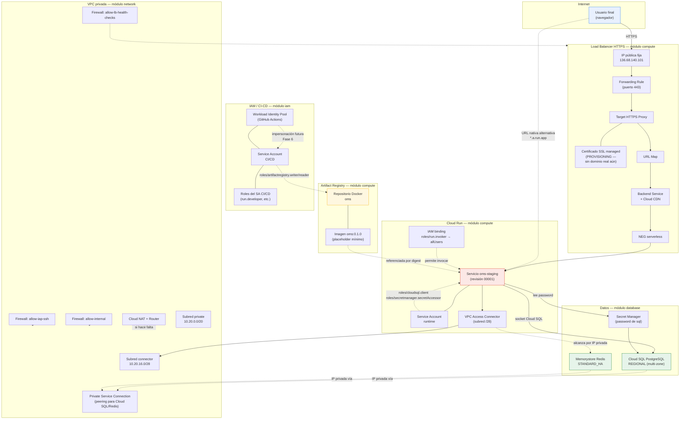

# DIAGRAMAS.md — AcmeOMS / oms-platform

> **Documento vivo.** Se actualiza en cada fase del proyecto. La versión actual cubre lo que está **construido, aplicado y verificado en GCP real** hasta la Fase 5 inclusive: 39 recursos en cada proyecto (`acmeoms-staging-fatm` y `acmeoms-production-fatm`), despliegue vía Ansible con lectura en vivo de `terraform output`, canary real en producción, y rollback probado deliberadamente contra ambos escenarios (con y sin canary activo). Cuando avance la Fase 6 (CI/CD) y la Fase 7 (bonus), este documento se amplía con los diagramas correspondientes — no se documenta aquí nada que todavía no exista de verdad.
>
> Para el detalle de cómo y por qué se construyó cada pieza (incluyendo los hallazgos y correcciones reales del camino), ver [`BITACORA-COMANDOS.md`](BITACORA-COMANDOS.md). Para el estado y las decisiones del proyecto, ver [`../PROGRESO.md`](../PROGRESO.md).

---

## 1 · Diagrama de relación entre artefactos

Vista completa de los 38 recursos aplicados, agrupados por módulo de Terraform, con las flechas mostrando quién depende de quién o quién se comunica con quién.

**Cómo leer las flechas:** líneas sólidas (`-->`) son el camino real del tráfico de una petición HTTP. Líneas punteadas (`-.->`) son relaciones de configuración/permisos (IAM, referencias) que no son tráfico en sí.

---

## 2 · Tabla resumen — qué es cada artefacto y para qué sirve

### Módulo `network` (10 recursos)

| Artefacto | Para qué sirve |
|---|---|
| VPC (`oms-staging-vpc`) | Red privada propia del proyecto; el "terreno" donde vive todo lo demás, aislado de otras redes |
| Subred `private` (`10.20.0.0/20`) | Rango de IPs privadas para recursos generales (hoy sin uso directo de VMs, preparada para el futuro) |
| Subred `connector` (`10.20.16.0/28`) | Rango de IPs dedicado y de tamaño exacto que exige GCP para el VPC Access Connector |
| Private Service Connection | El "puente" que permite que Cloud SQL y Redis (servicios gestionados de Google, fuera de tu VPC) tengan una IP privada dentro de tu red |
| Cloud Router + Cloud NAT | Permite que recursos sin IP pública puedan iniciar conexiones salientes a internet, sin exponer nada a conexiones entrantes |
| Firewall `allow-internal` | Permite que los recursos de la propia VPC se hablen entre sí (por defecto, todo está bloqueado incluso internamente) |
| Firewall `allow-iap-ssh` | Permite SSH seguro sin IP pública, vía Identity-Aware Proxy — preparado para el bastion del bonus (aún no usado) |
| Firewall `allow-lb-health-checks` | Permite que el Load Balancer verifique que Cloud Run está vivo, desde los rangos oficiales de Google |

### Módulo `database` (7 recursos)

| Artefacto | Para qué sirve |
|---|---|
| Cloud SQL (`oms-staging-postgres`) | Base de datos relacional PostgreSQL, en modo `REGIONAL` (alta disponibilidad multi-zona) |
| Base de datos `oms` | La base de datos lógica dentro de la instancia, donde vivirían las tablas de la aplicación real |
| Usuario `oms_app` | Credencial de aplicación para conectarse a la base de datos (no la del administrador) |
| `random_password` | Generador de la contraseña aleatoria del usuario de la base de datos — nunca escrita a mano en el código |
| Secret (`oms-staging-db-password`) + su versión | Almacén seguro de esa contraseña, para que la aplicación la lea en tiempo de ejecución sin que quede en texto plano en ningún archivo |
| Memorystore Redis | Caché en memoria, pensada para acelerar lecturas frecuentes (ej. catálogo de productos) |

### Módulo `compute` (10 recursos)

| Artefacto | Para qué sirve |
|---|---|
| Service Account `runtime` | La "identidad" con la que corre el contenedor de la aplicación (permisos mínimos: leer secretos, conectar a la base de datos) |
| Artifact Registry (`oms`) | El almacén privado donde vive la imagen Docker de la aplicación |
| VPC Access Connector | El puente que permite a Cloud Run (que vive fuera de tu VPC) alcanzar Redis por IP privada |
| Servicio Cloud Run (`oms-staging`) | Donde realmente corre el contenedor de la aplicación — escala automáticamente según la carga |
| Permiso de invocación pública | Autoriza que cualquiera pueda llamar al servicio (sin esto, Cloud Run rechaza toda petición) |
| NEG serverless | El "puntero" que conecta el mundo de Load Balancers con un servicio sin servidor como Cloud Run |
| Backend Service + Cloud CDN | Agrupa el NEG y define la política de caché de contenido estático |
| URL Map | Decide, según la URL pedida, a qué backend enviar la petición |
| Certificado SSL managed | El certificado HTTPS del dominio (hoy en `PROVISIONING`, pendiente de un dominio real) |
| Target HTTPS Proxy + Forwarding Rule + IP pública | Las piezas finales que conectan la IP pública fija con el tráfico HTTPS entrante |

### Módulo `iam` (11 recursos)

| Artefacto | Para qué sirve |
|---|---|
| Workload Identity Pool + Provider | El mecanismo que permitirá a GitHub Actions autenticarse ante GCP sin ninguna clave guardada (Fase 6) |
| Service Account `cicd` | La identidad que usará el pipeline de despliegue automático |
| Binding de impersonación | Autoriza que solo el repositorio de GitHub correcto pueda "convertirse" en ese Service Account |
| Roles del SA `cicd` (×4) | Permisos mínimos del pipeline: desplegar en Cloud Run, usar el SA de runtime, publicar/leer imágenes |
| Roles del SA `runtime` (×2) | Permisos mínimos del contenedor en ejecución: conectar a Cloud SQL, leer el secreto de la contraseña |

---

## 2.bis · Diagrama de flujo — de dónde sale el build y quién lo despliega cada vez

Este diagrama responde a una pregunta distinta de la del diagrama 1: no "qué recursos existen", sino **"quién construye/despliega qué, en qué orden, y qué cambia entre la primera ejecución y las siguientes"**. Cubre las Fases 3-5 completas (Docker, Terraform, Ansible), incluyendo staging vs producción, el caso especial del primer despliegue (sin revisión previa), el canary real del 10% en producción, y el rollback — todo verificado contra GCP real, no solo diseñado en papel.

**Convención de colores de los círculos numerados:**
- 🔵 **Azul** = pasos de la **corrida inicial** (build + `terraform apply` la primera vez que existe el servicio)
- 🟠 **Naranja** = pasos de **corridas subsecuentes** (Ansible desplegando una imagen nueva sobre un servicio que ya existe)
- 🔴 **Rojo** = pasos de **rollback** (recuperación ante un despliegue con problemas)

```mermaid
flowchart TB
    subgraph build["① BUILD — una sola vez por versión, fuera de Terraform/Ansible"]
        code["Código fuente<br/>(server.js, Dockerfile)"]
        dockerbuild(("① docker build"))
        digest["Imagen con digest único<br/>sha256:d68ca4fc..."]
        pushstg(("② docker push<br/>→ Artifact Registry STAGING"))
        code --> dockerbuild --> digest --> pushstg
    end

    subgraph tf_init["② TERRAFORM — SOLO la corrida inicial crea el servicio"]
        tfvars["terraform/envs/staging.tfvars<br/>(image_sha = el de arriba,<br/>SOLO importa la 1ª vez)"]
        tfapply(("③ terraform apply<br/>(staging)"))
        crv1["Cloud Run creado:<br/>revisión oms-staging-00001<br/>100% tráfico, imagen del apply"]
        tfvars --> tfapply --> crv1
    end

    subgraph ansible_stg["③ ANSIBLE — despliegues SIGUIENTES a staging (⚠ y también el 1º vía Ansible si aplica)"]
        readtf1(("④ terraform output -json<br/>(lee cpu/mem/instancias)"))
        ansdeploy_stg(("⑤ ansible-playbook deploy.yml<br/>-e env=staging"))
        crv2["Nueva revisión oms-staging-00010<br/>--no-traffic al crearla"]
        trafstg(("⑥ update-traffic<br/>100% (staging = big-bang)"))
        readtf1 --> ansdeploy_stg --> crv2 --> trafstg
    end

    subgraph promote["④ PROMOCIÓN — copiar el MISMO digest a producción"]
        pull(("⑦ docker pull<br/>(por digest, desde staging)"))
        pushprod(("⑧ docker tag + push<br/>→ Artifact Registry PRODUCCIÓN"))
        samedigest["MISMO sha256:d68ca4fc...<br/>verificado idéntico"]
        pull --> pushprod --> samedigest
    end

    subgraph first_prod["⑤ PRODUCCIÓN — primer despliegue (caso especial: SIN revisión previa)"]
        tfapplyprod(("⑨ terraform apply<br/>(producción, 1ª vez)"))
        crprod1["Cloud Run creado:<br/>revisión oms-production-00001<br/>100% tráfico (no hay canary posible:<br/>no existe nada a lo que dejarle el 90%)"]
        tfapplyprod --> crprod1
    end

    subgraph ansible_prod["⑥ ANSIBLE — despliegues SIGUIENTES a producción (canary real)"]
        readtf2(("④ terraform output -json"))
        ansdeploy_prod(("⑩ ansible-playbook deploy.yml<br/>-e env=production<br/>(sin -e traffic_percent, usa el 10% default)"))
        crprod2["Nueva revisión oms-production-00003<br/>tag rev-d68ca4fc, --no-traffic al crearla"]
        canary(("⑪ update-traffic<br/>--to-tags rev-d68ca4fc=10"))
        split["REPARTO REAL VERIFICADO:<br/>00002-dsl (vieja) → 90%<br/>00003-yod (nueva) → 10%"]
        readtf2 --> ansdeploy_prod --> crprod2 --> canary --> split
    end

    subgraph promote_canary["⑦ PROMOCIÓN DEL CANARY — si el 10% se ve sano"]
        promo(("⑫ update-traffic<br/>--to-tags rev-d68ca4fc=100"))
        full100["00003-yod → 100%<br/>(verificado: /health → version 0.2.0)"]
        promo --> full100
    end

    subgraph rollback_flow["⑧ ROLLBACK — vuelta a la revisión anterior"]
        checktraffic{"¿Hay EXACTAMENTE<br/>1 revisión al 100%?"}
        failcanary["❌ FALLA a propósito si el<br/>tráfico está repartido en canary<br/>(verificado: no hace nada silencioso)"]
        okrollback(("⑬ ansible-playbook rollback.yml<br/>-e env=production"))
        findprev["Busca N-1 en status.traffic[]<br/>(NO por fecha de creación)"]
        applyrollback(("⑭ update-traffic<br/>--to-revisions 00002-dsl=100"))
        restored["00002-dsl → 100%<br/>(verificado: /health SIN version,<br/>= la imagen anterior)"]
        checktraffic -->|no, hay canary activo| failcanary
        checktraffic -->|sí, 1 sola al 100%| okrollback --> findprev --> applyrollback --> restored
    end

    pushstg --> tfapply
    crv1 -.->|servicio ya existe:<br/>siguientes cambios de imagen<br/>los hace Ansible, no Terraform| readtf1
    trafstg -.->|imagen ya validada en staging| pull
    samedigest --> tfapplyprod
    crprod1 -.->|servicio ya existe:<br/>próximos despliegues, vía Ansible| readtf2
    split -.->|decisión: promover o rollback| promote_canary
    split -.->|decisión: promover o rollback| checktraffic
    full100 -.->|si algo falla después| checktraffic

    style dockerbuild fill:#e8f0fe,stroke:#1a73e8,stroke-width:3px
    style pushstg fill:#e8f0fe,stroke:#1a73e8,stroke-width:3px
    style tfapply fill:#e8f0fe,stroke:#1a73e8,stroke-width:3px
    style tfapplyprod fill:#e8f0fe,stroke:#1a73e8,stroke-width:3px
    style readtf1 fill:#fef7e0,stroke:#f9ab00,stroke-width:3px
    style ansdeploy_stg fill:#fef7e0,stroke:#f9ab00,stroke-width:3px
    style trafstg fill:#fef7e0,stroke:#f9ab00,stroke-width:3px
    style pull fill:#fef7e0,stroke:#f9ab00,stroke-width:3px
    style pushprod fill:#fef7e0,stroke:#f9ab00,stroke-width:3px
    style readtf2 fill:#fef7e0,stroke:#f9ab00,stroke-width:3px
    style ansdeploy_prod fill:#fef7e0,stroke:#f9ab00,stroke-width:3px
    style canary fill:#fef7e0,stroke:#f9ab00,stroke-width:3px
    style promo fill:#fef7e0,stroke:#f9ab00,stroke-width:3px
    style okrollback fill:#fce8e6,stroke:#d93025,stroke-width:3px
    style applyrollback fill:#fce8e6,stroke:#d93025,stroke-width:3px
    style failcanary fill:#fce8e6,stroke:#d93025,stroke-width:2px,stroke-dasharray: 5 5
```

**Puntos clave que este diagrama deja explícitos (todos verificados contra GCP real, no solo diseñados):**

1. **Terraform solo crea el servicio Cloud Run la PRIMERA vez.** A partir de ahí, `image`, `traffic`, `client` y `revision` están en `lifecycle.ignore_changes` — Terraform "suelta" esos campos y nunca vuelve a tocarlos, para no pisarse con Ansible en cada `apply` posterior.
2. **`cpu`/`memory`/`min_instances`/`max_instances` SIEMPRE vienen de Terraform**, incluso en despliegues de Ansible — se leen en vivo con `terraform output -json` (círculos ④), nunca se duplican a mano en `group_vars`.
3. **Staging es "big-bang"** (100% de tráfico inmediato a la nueva revisión) — **producción es canary real** (10% inicial, verificado con dos revisiones sirviendo tráfico simultáneamente y confirmado con `curl` contra la URL con tag vs la URL principal).
4. **El primer despliegue a producción es un caso especial**: no existe una revisión previa a la que dejarle el 90% restante, así que ese único despliegue usa 100% (decisión documentada), y el canary del 10% solo tiene sentido a partir de la *segunda* promoción en adelante.
5. **El rollback tiene una condición de guarda real**: si el tráfico está repartido en canary (ninguna revisión al 100%), el playbook **falla explícitamente** en vez de adivinar a cuál volver — verificado provocándolo a propósito.
6. **El rollback busca la revisión anterior por tráfico real (`status.traffic[]`), no por fecha de creación** — un hallazgo real de esta fase: la revisión creada más recientemente no siempre es la que tiene tráfico.

---

## 3 · Glosario de términos

| Término | Qué significa |
|---|---|
| **VPC** (Virtual Private Cloud) | Tu red privada propia dentro de GCP — el equivalente en la nube a la red local de una oficina, aislada de otras redes |
| **Subred** | Un rango específico de direcciones IP dentro de la VPC, asociado a una región, donde se alojan recursos |
| **CIDR** | Notación para expresar un rango de IPs (ej. `10.20.0.0/16`) — el número tras la barra indica cuántos bits están "fijos" |
| **IAM** (Identity and Access Management) | El sistema de GCP que controla quién (persona o programa) puede hacer qué, sobre qué recursos |
| **Service Account (SA)** | Una "identidad" para que un programa (no una persona) se autentique y tenga permisos — el equivalente a un usuario, pero para máquinas |
| **Rol IAM** | Un conjunto de permisos agrupados con un nombre (ej. `roles/run.developer` = "puede desplegar en Cloud Run") |
| **WIF** (Workload Identity Federation) | Mecanismo que permite a un sistema externo (como GitHub Actions) autenticarse ante GCP sin usar una clave descargada, mediante tokens temporales |
| **OIDC** (OpenID Connect) | El protocolo estándar sobre el que funciona WIF — un token firmado que certifica "quién eres" sin necesitar una contraseña |
| **Cloud Run** | Servicio "serverless" (sin gestión de servidores) que ejecuta contenedores Docker, escalando automáticamente según la demanda |
| **Revisión (Cloud Run)** | Una versión inmutable de un despliegue de Cloud Run — cada vez que despliegas, se crea una revisión nueva, sin borrar las anteriores |
| **Canary / traffic splitting** | Técnica de desplegar una versión nueva dándole solo un porcentaje del tráfico real, para detectar problemas antes de que afecten a todos los usuarios |
| **VPC Access Connector** | El "puente" que permite a Cloud Run (que vive fuera de la VPC) alcanzar recursos privados dentro de ella, como Redis |
| **Cloud NAT** | Mecanismo que traduce IPs privadas a una IP pública para permitir salida a internet, sin exponer nada a conexiones entrantes |
| **Cloud Router** | El recurso del que depende Cloud NAT en GCP — Cloud NAT siempre se configura como una extensión de un router |
| **Load Balancer (LB)** | El componente que reparte el tráfico entrante hacia el backend correcto, y en este proyecto también gestiona HTTPS y el CDN |
| **NEG** (Network Endpoint Group) | El "puntero" que le dice a un Load Balancer dónde está realmente el destino (en este caso, un servicio serverless) |
| **Backend Service** | Agrupa uno o más NEGs y define políticas comunes (como el caché del CDN) |
| **URL Map** | La pieza del Load Balancer que decide, según la URL pedida, a qué Backend Service enviarla |
| **Certificado SSL managed** | Un certificado HTTPS que Google emite y renueva automáticamente, a diferencia de gestionar tú mismo los certificados |
| **Forwarding Rule** | Conecta una IP pública con un proxy/servicio específico — el "cable final" del Load Balancer |
| **Cloud SQL** | Base de datos relacional (PostgreSQL en este proyecto) gestionada por Google |
| **REGIONAL (availability_type)** | Modo de alta disponibilidad de Cloud SQL: mantiene una réplica sincronizada en otra zona para failover automático |
| **PITR** (Point-In-Time Recovery) | Capacidad de restaurar la base de datos al estado exacto de cualquier momento dentro de un período de retención |
| **Memorystore** | El servicio gestionado de GCP para Redis (caché en memoria) |
| **Secret Manager** | Almacén seguro de GCP para contraseñas, tokens y otros datos sensibles, con control de acceso vía IAM |
| **Artifact Registry** | Repositorio privado de GCP para guardar imágenes Docker (y otros paquetes) |
| **Digest / SHA-256** | Huella criptográfica única e inmutable de una imagen Docker — a diferencia de una etiqueta (`:latest`), el digest siempre apunta exactamente al mismo contenido |
| **Terraform** | Herramienta de "Infraestructura como Código": describes en archivos `.tf` qué recursos deben existir, y la herramienta los crea/actualiza/destruye por ti |
| **Módulo (Terraform)** | Una agrupación reutilizable de recursos relacionados (en este proyecto: `network`, `database`, `compute`, `iam`) |
| **`terraform plan`** | Simula los cambios que se harían, sin aplicarlos — para revisar antes de actuar |
| **`terraform apply`** | Ejecuta de verdad los cambios sobre la infraestructura real |
| **Estado (`tfstate`)** | El registro que usa Terraform para saber qué existe y con qué configuración — en este proyecto vive en un bucket remoto de Cloud Storage, no en el disco local |
| **Backend remoto** | La configuración que le dice a Terraform dónde guardar su estado (aquí, un bucket de GCS) en vez de un archivo local |
| **`-target`** | Flag de Terraform para limitar una operación a un recurso específico, en vez de todo el proyecto — uso excepcional, no rutinario |
| **`depends_on`** | Instrucción explícita en Terraform para forzar que un recurso espere a que otro exista primero, cuando no hay una referencia directa entre ellos |
| **`terraform import`** | Comando para registrar en el estado de Terraform un recurso que ya existe en la nube, sin volver a crearlo |
| **Ansible** | Herramienta de automatización que ejecuta tareas (como desplegar una imagen nueva) de forma repetible e idempotente |
| **Idempotencia** | Propiedad de que ejecutar la misma operación varias veces produce el mismo resultado que ejecutarla una sola vez, sin efectos secundarios acumulativos |
| **CI/CD** | Integración y despliegue continuos — automatizar la construcción, prueba y despliegue del software |
| **GFE** (Google Front End) | La capa de infraestructura interna de Google que recibe y enruta todo el tráfico hacia sus servicios (incluido Cloud Run) — puede interceptar ciertas rutas convencionales antes de que lleguen a tu aplicación |
| **Healthcheck / probe** | Verificación automática de que un servicio está "vivo" y respondiendo correctamente |
| **`startup_probe`** | Verificación que se ejecuta solo al arrancar un contenedor nuevo, antes de enviarle tráfico real |
| **`liveness_probe`** | Verificación continua durante toda la vida de una instancia; si falla repetidamente, se reinicia el contenedor |
| **`terraform output`** | Comando que muestra los valores que un módulo de Terraform expone deliberadamente (ej. una URL, una IP, o —en este proyecto— la CPU/memoria configurada); otras herramientas (aquí, Ansible) pueden leerlos para no duplicar esa información a mano |
| **`lifecycle.ignore_changes`** | Instrucción de Terraform para decirle "declara este campo al crear el recurso, pero nunca vuelvas a tocarlo en futuros `apply`" — útil cuando otra herramienta (aquí, Ansible) es quien gestiona ese campo después |
| **Recurso `tainted`** | Estado interno de Terraform que marca un recurso como "quedó en un estado inconsistente tras un fallo a mitad de creación" — el siguiente `apply` lo destruye y recrea automáticamente, sin intervención manual |
| **Promoción (de una imagen)** | Copiar una imagen Docker ya construida y probada de un registro a otro (ej. de staging a producción) sin reconstruirla — el digest SHA-256 resultante es idéntico, porque es un hash del contenido, no de la ubicación |
| **Milicore (`m`, ej. `1000m`)** | Unidad para expresar fracciones de un CPU virtual: `1000m` = 1 CPU completo, `500m` = medio CPU. Cloud Run solo acepta valores entre `80m` y `1000m`, o enteros exactos (`1`, `2`, `4`, `6`, `8`) — no admite fracciones intermedias como `1.5` |
| **Canary (promoción gradual)** | Enviar un porcentaje pequeño del tráfico real a una revisión nueva (ej. 10%) mientras el resto sigue en la versión anterior, para detectar problemas antes de exponer a todos los usuarios — verificado en este proyecto con dos revisiones de producción sirviendo tráfico real y distinto contenido simultáneamente |

---

## Historial de cambios de este documento

| Fecha | Cambio |
|---|---|
| 2026-09-21 | Creación inicial — diagrama y glosario cubriendo los 38 recursos de las Fases 1, 2 y 3 (network, database, compute, iam) |
| 2026-09-22 | Fase 4 y 5: agregado el diagrama de flujo "de dónde sale el build y quién despliega cada vez" (sección 2.bis) — cubre Docker build, Terraform en la corrida inicial, Ansible en corridas subsecuentes leyendo `terraform output`, staging vs producción, el caso especial del primer despliegue sin revisión previa, canary real del 10% verificado con tráfico dividido de verdad, y rollback (incluyendo su condición de guarda cuando el tráfico está repartido en canary). 6 términos nuevos en el glosario |
